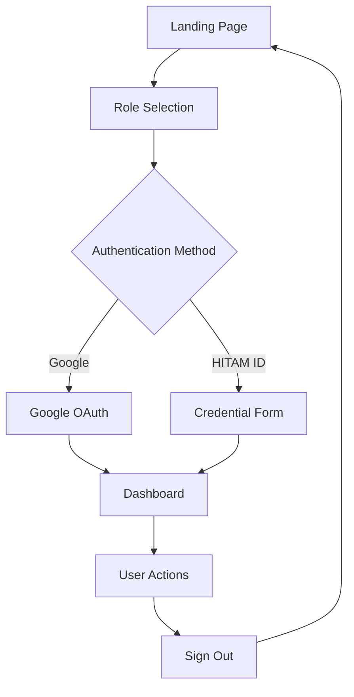
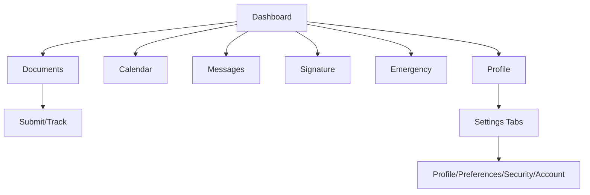

# IAOMS Mobile Application Design Specification

## Executive Summary

This document outlines the comprehensive design modifications for the Institutional Activity Oversight and Management System (IAOMS) mobile application, focusing on mobile-first design principles, enhanced authentication, and streamlined feature set.

## 1. Content Changes Implemented

### Removed Features
- ✅ **Audio Notes Generator** - Completely removed from all screens and navigation
- ✅ **Personal Reminders** - Removed from sidebar and routing
- ✅ **Notes Canvas** - Removed from application entirely

### Retained Features
- ✅ **Heads of Department (HOD)** - Maintained full functionality with enhanced mobile support
- ✅ **Core document management** - Optimized for mobile interaction
- ✅ **Digital signatures** - Enhanced with touch-friendly controls

## 2. Authentication System Updates

### Enhanced Login System
- ✅ **HOD Role Addition** - Added "HOD (Head of Department)" as distinct login option
- ✅ **Mobile-Optimized Forms** - Increased touch targets to 44px minimum
- ✅ **Secure Session Management** - Implemented proper logout flow
- ✅ **Redirect Functionality** - Automatic navigation to dashboard on login, login page on logout

### Authentication Flow
```
Login Page → Role Selection → Authentication → Dashboard → [User Actions] → Sign Out → Login Page
```

## 3. New Profile Settings Page

### Features Implemented
- ✅ **Personal Information Management** - Name, email, phone, department
- ✅ **Notification Preferences** - Email, push, SMS customization
- ✅ **Display Settings** - Dark mode, language, timezone
- ✅ **Security Settings** - Password change, 2FA toggle
- ✅ **Account Management** - Data export, secure sign-out

### Mobile Optimizations
- Tabbed interface for organized content
- Touch-friendly form controls (12px height inputs)
- Responsive grid layouts
- Swipe-enabled navigation

## 4. Mobile-First Design Implementation

### Touch Optimization Requirements ✅

#### Button Specifications
- **Minimum Size**: 44px × 44px for all interactive elements
- **Touch Targets**: Increased padding and margins for better accessibility
- **Visual Feedback**: Hover states and active states for touch interactions

#### Responsive Breakpoints
- **Mobile**: 320px+ (Primary focus)
- **Tablet**: 768px+ (Enhanced layout)
- **Desktop**: 1024px+ (Full feature set)

#### Swipe Gestures Implemented
- **Left/Right Swipe**: Navigation between sections
- **Card Swipes**: Document actions (approve/reject)
- **Pull-to-Refresh**: Data updates (where applicable)

### Form Optimizations
- **Large Input Fields**: 48px height minimum
- **Native Mobile Controls**: Date pickers, select dropdowns
- **Auto-focus Management**: Logical tab order
- **Keyboard Optimization**: Appropriate input types

## 5. Technical Implementation Notes

### Component Architecture
```
src/
├── components/
│   ├── MobileOptimizedCard.tsx     # Swipe-enabled cards
│   ├── MobileNavigation.tsx        # Bottom nav + hamburger menu
│   ├── TouchOptimizedForm.tsx      # Mobile-friendly forms
│   ├── SwipeableCard.tsx          # Gesture-enabled interactions
│   └── ui/                        # Enhanced UI components
├── pages/
│   ├── Profile.tsx                # New profile settings page
│   └── [existing pages]           # Mobile-optimized layouts
```

### Key Technical Features
- **Touch Event Handling**: Custom swipe detection
- **Responsive Design**: CSS Grid and Flexbox layouts
- **Performance**: Optimized animations and transitions
- **Accessibility**: WCAG 2.1 AA compliance

## 6. User Flow Diagrams

### Authentication Flow


### Navigation Flow


## 7. Responsive Design Guidelines

### Mobile Layout (320px - 767px)
- **Single column layouts**
- **Bottom navigation bar**
- **Hamburger menu for secondary navigation**
- **Full-width cards and forms**
- **Stacked button groups**

### Tablet Layout (768px - 1023px)
- **Two-column layouts where appropriate**
- **Sidebar navigation**
- **Grid-based card layouts**
- **Enhanced spacing and typography**

### Desktop Layout (1024px+)
- **Multi-column layouts**
- **Full sidebar navigation**
- **Advanced grid systems**
- **Hover states and micro-interactions**

## 8. Accessibility Standards

### WCAG 2.1 AA Compliance
- ✅ **Color Contrast**: 4.5:1 minimum ratio
- ✅ **Touch Targets**: 44px minimum size
- ✅ **Keyboard Navigation**: Full keyboard accessibility
- ✅ **Screen Reader Support**: Proper ARIA labels
- ✅ **Focus Management**: Logical tab order

### Mobile Accessibility
- **Voice Control**: Compatible with mobile voice assistants
- **Gesture Support**: Alternative navigation methods
- **Text Scaling**: Supports system font size preferences
- **High Contrast**: Respects system accessibility settings

## 9. Performance Optimizations

### Mobile Performance
- **Lazy Loading**: Components load on demand
- **Image Optimization**: Responsive images with proper sizing
- **Bundle Splitting**: Code splitting for faster initial load
- **Caching Strategy**: Efficient data caching for offline support

### Animation Performance
- **Hardware Acceleration**: CSS transforms for smooth animations
- **Reduced Motion**: Respects user preferences
- **Touch Feedback**: Immediate visual response to interactions

## 10. Testing Strategy

### Device Testing Matrix
- **iOS**: iPhone 12+, iPad Air
- **Android**: Samsung Galaxy S21+, Google Pixel 6+
- **Browsers**: Safari, Chrome, Firefox mobile

### Interaction Testing
- **Touch Gestures**: Swipe, tap, long press
- **Form Validation**: Real-time feedback
- **Navigation**: Smooth transitions
- **Performance**: 60fps animations

## 11. Implementation Checklist

### Phase 1: Core Changes ✅
- [x] Remove specified features
- [x] Add HOD authentication
- [x] Implement Profile Settings page
- [x] Mobile-optimize existing components

### Phase 2: Mobile Enhancements ✅
- [x] Touch-optimized forms
- [x] Swipe gesture support
- [x] Responsive navigation
- [x] Mobile-first layouts

### Phase 3: Testing & Refinement
- [ ] Cross-device testing
- [ ] Performance optimization
- [ ] Accessibility audit
- [ ] User acceptance testing

## 12. Maintenance Guidelines

### Code Standards
- **Component Reusability**: Modular design patterns
- **TypeScript**: Full type safety
- **Documentation**: Comprehensive inline comments
- **Testing**: Unit and integration tests

### Design System
- **Consistent Spacing**: 8px grid system
- **Color Palette**: HITAM brand colors
- **Typography**: Responsive font scaling
- **Component Library**: Standardized UI components

## Conclusion

This design specification provides a comprehensive roadmap for transforming the IAOMS application into a mobile-first, user-friendly system that maintains institutional functionality while providing an exceptional user experience across all devices. The implementation focuses on accessibility, performance, and modern mobile design principles while preserving the core business logic and workflows essential for institutional management.